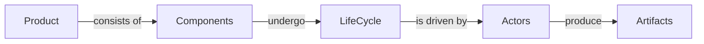

### Overview
- OMC -  as a software **product** - consists of a number of **components**
- Components undergo a life cycle
- Life cycle is driven by actors
- Actors produce artifacts using tools

### Actors, tools and artifacts
|Actor|Tool|Artifact|URI|Git
|--|--|--|--|--|
|Product owner| Aha.io |Feature|Feature number|no
|BA|VSCode or IntelliJ|User story|git URL|yes
|Tester|VSCode or IntelliJ|Scenario|?|yes
|Developer|VSCode or IntelliJ|JIRA|Ticket number|yes

##### TODO
 1. Relationships between Aha Features and BA user stories
 2. Relationship between BA user stories and Testers Cuke Scenarios and Features
 3. Relationship between Tester Cukes and Development JIRA
 4. For all of the above one|many to one|many
 5. Versioning/packaging rules

<!--stackedit_data:
eyJoaXN0b3J5IjpbLTIwMzc3NTA5MzAsLTQzMTIwOTYyNiwtMT
g4NTAzNDY5MiwxNDU0NzA4NzMxLC02NzkxNDYyNzAsMTgzMDM5
MDQ1NSwtNDY2MzUxODQ5XX0=
-->