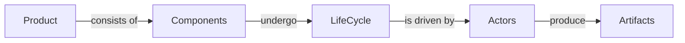

### Overview
- OMC -  as a software **product** - consists of a number of **components**
- Components undergo a life cycle
- Life cycle is driven by actors
- Actors produce artifacts using tools

### Actors, tools and artifacts
|Actor|Tool|Artifact|URI
|--|--|--|--|
|Product owner| Aha.io |Feature|Feature number
|BA|Any editor supporting .md|User story|git URL
|Tester|Any editor supporting Cukes|Scenario
|Developer|smth|JIRA|Ticket number

##### TODO

 1. Relationships between Aha Features and BA user stories
 2. Relationship between BA user stories and Testers Cuke Scenarios and Features
 3. Relationship between Tester Cukes and Development JIRA
 4. Versioning rules

<!--stackedit_data:
eyJoaXN0b3J5IjpbLTE3MDcyNDM1MTIsLTQzMTIwOTYyNiwtMT
g4NTAzNDY5MiwxNDU0NzA4NzMxLC02NzkxNDYyNzAsMTgzMDM5
MDQ1NSwtNDY2MzUxODQ5XX0=
-->