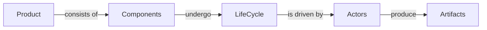

### Overview
 - OMC -  as a software **product** - consists of a number of **[components**](https://github.com/denisurusov/omcmeta/blob/master/docs/components.md)
 - Components undergo a LifeCycle
 - Life cycle is driven by Actors
 - Actors produce Artifacts
 - Artifacts are managed in Tools
 - Tools expose APIs
 - APIs are access by a dashboard (*we really just want to build one*)
 - The dashboard is used to monitor and track product 

### Actors, tools and artifacts reference
|Actor|Tool|Artifact|URI|Git
|--|--|--|--|--|
|Product owner| Aha.io |Feature|Feature number|no
|BA|VSCode or IntelliJ|User story|git URL|yes
|Tester|VSCode or IntelliJ|Scenario|?|yes
|Developer|VSCode or IntelliJ|JIRA|Ticket number|yes

### TODO - Relationship between artifacts
 1. Relationships between Aha Features and BA user stories
 2. Relationship between BA user stories and Testers Cuke Scenarios and Features
 3. Relationship between Tester Cukes and Development JIRA
 4. For all of the above one|many to one|many
 ### TODO - CI/CD integration
 1. Versioning/packaging rules for artifacts

<!--stackedit_data:
eyJoaXN0b3J5IjpbMTEyMjc5NTM4OCwtNTAwMTgzMjk4LC0yMD
M3NzUwOTMwLC00MzEyMDk2MjYsLTE4ODUwMzQ2OTIsMTQ1NDcw
ODczMSwtNjc5MTQ2MjcwLDE4MzAzOTA0NTUsLTQ2NjM1MTg0OV
19
-->